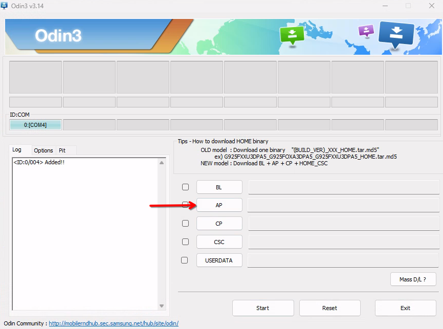
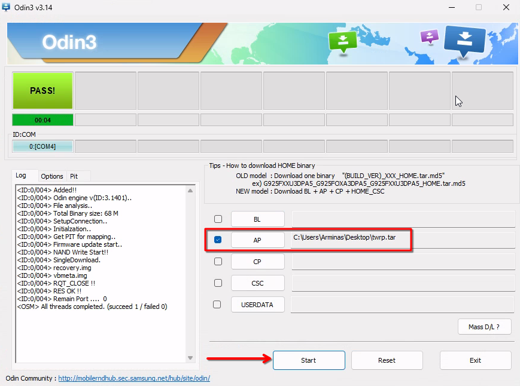

# Flashing TWRP and UEFI on Galaxy A52s 5G

This guide will help you flash TWRP and UEFI on your device.

Table of Contents:

* [Flashing TWRP and UEFI on Galaxy A52s 5G)](#Flashing-TWRP-and-UEFI-on-Galaxy-A52s-5G)
   * [Files/Tools Needed](#filestools-needed)
* [Steps](#steps)
   * [Acquiring all files](#acquiring-all-files)
   * [Entering Download mode on Galaxy A52s 5G](#entering-download-mode-on-galaxy-a52s-5g)
   * [Flashing with Odin](#flashing-with-odin)
   * [Backing up Android boot image](#backing-up-android-boot-image)
   * [Flashing UEFI](#flashing-uefi)
   * [The End](#the-end)

## Files/Tools Needed

- A Galaxy A52s 5G
- [Samsung USB drivers](https://developer.samsung.com/android-usb-driver)
- [Odin flashing utility](../Files/Odin3_v3.14.4.zip)
- [TWRP image](../Files/twrp.tar)
- [UEFI image](https://github.com/woa-a52s/Galaxy-A52s-5G-Releases)
- [SDK Platform Tools](https://developer.android.com/tools/releases/platform-tools)
- A Windows PC to flash the device

## Disclaimers

> [!WARNING]
> - If you see a warning and/or error during the process, it is not normal. Contact us on telegram if you see anything odd, but do not continue or proceed on your own, you will break things further.
>
> - We don't take any responsibility for any damage done to your phone. By following this guide, you agree to take full responsibility of your actions. We have done some testing,
> but this is **STILL IN PREVIEW** and things can go wrong.

**PLEASE READ AND BE SURE TO UNDERSTAND THE ENTIRE GUIDE BEFORE STARTING**

# Steps

## Acquiring all files

From the "Files/Tools needed" section:

- Download and install Samsung USB drivers

- Acquire the Odin flashing utility and extract the archive on your computer.

- Download twrp.tar and keep in somewhere accessible on your PC

- Download UEFI.img from the latest release attachments in the Galaxy-A52s-5G-Releases page

## Entering Download mode on Galaxy A52s 5G

To enter the Download mode on Galaxy A52s 5G, follow these steps:

- While the device is powered off, hold both volume up and volume down buttons at the same time
- Connect Galaxy A52s to the computer with a USB cable
- Release the buttons when device boots to Download mode

## Flashing with Odin

- Open the Odin executable that you have previously acquired and extracted.

- Click on the AP slot and select a .tar file containing the TWRP image:



> [!NOTE]
> After flashing the recovery image it's important to **not** let the device boot Android, as that will auto-replace a custom recovery with a stock one.

- After loading the AP slot, click on the "Start" button to flash the provided image



After a successful flash the device will automatically reboot itself. Hold the volume up and power buttons with a USB cable connected to boot the TWRP recovery.

## Backing up Android boot image

TWRP recovery Backup functions will be used to backup boot images. This step is important, because flashing UEFI will overwrite the Android boot image.

- In TWRP recovery home page open the "Backup" page
- Tick the `Boot` check-box
- Press the "Select storage" button and choose where you want to back up the image to

> [!NOTE]
> If you're gonna flash an FFU file, the flashing procedure will format Android data, in turn deleting your boot image backup. Consider backing up to an SD card, or your computer using adb.

- Swipe right to backup the boot image

For restoring the boot image later, use the "Restore" section in the main TWRP page.

## Flashing UEFI

There are a few ways to flash the UEFI image to Galaxy A52s 5G.

**Option 1**: Refer to the guide's [Flashing with Odin](#flashing-with-odin) section and flash the UEFI image with Odin. Use an archiving utility, rename UEFI.img to boot.img and compress it to .tar file. Flash the compressed UEFI .tar image with Odin, loading it in the **AP** slot.

**Option 2**: Make sure [SDK Platform Tools](https://developer.android.com/tools/releases/platform-tools) are installed on your computer.

> [!NOTE]
> Make sure that adb.exe is on PATH in your terminal environment (or run the below command inside the SDK Platform Tools directory where adb.exe is located).

Open the command prompt on your PC and execute the following command to push the UEFI .img file to recovery:

```batch
adb push C:\Path\To\UEFI.img /sdcard
```

The provided command will send the UEFI.img file that is located in the C:\Path\To\UEFI.img directory to your phone's /sdcard directory.

After pushing the file, in TWRP recovery menu open the "Install" page, at the bottom-right corner press the "Image" button, find UEFI.img file in the /sdcard directory and flash it to `Boot` slot.

## The End

And we're done, please continue with the previous guide that made you land here :)
