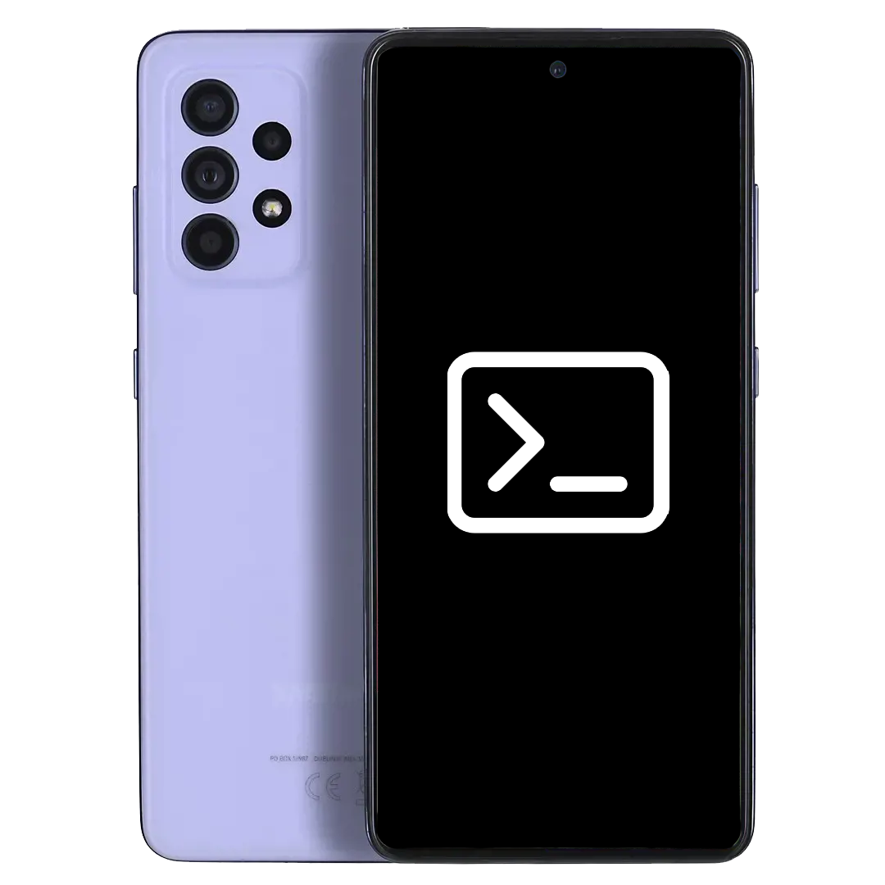

# Install Windows on Galaxy A52s 5G

## A few notes

> [!WARNING]
> Welcome! Thanks for being interested in trying out this project. We thought the following notes may interest you first before proceeding further:
>
> We recommend you know what you're getting into here. You need to know a bit about command line interfaces, Windows technical aspects, as this is not for the faint of heart yet! We won't teach you how to port the OS yourself, we've done this for you, but this is not for beginners or common users either. Tech Savvy people only or technical people only please, or you'll regret it or commit mistakes that may take some time to solve with us!
>
> We do not recommend you run this experimental firmware on a Galaxy A52s 5G device if it's your main phone, as potentially unexpected behaviour (including a device brickage) can occur, especially if you're not a very experienced end-user. This project is by any means not responsible for potential damage done to the device, end-user is responsible for his own actions. Consider yourself warned! 

> [!CAUTION]
> Only BIT-10 Bootloader version is supported. Installing Windows while having a lower or higher bootloader version **will brick your device**. Do not proceed if your BL version is anything other than BIT 10.

There are three methods to install Windows:

| **Flash a Full Flash Update (FFU) file**                                                                       | ~~**Install Windows using the WOA Deployment tool**~~                                                              |  **Install Windows Manually yourself**                                                                         |
|----------------------------------------------------------------------------------------------------------------|--------------------------------------------------------------------------------------------------------------------|----------------------------------------------------------------------------------------------------------------|
|                              |                                                          |              |
| - Easiest                                                                                                      | ~~- Easy~~                                                                                                         | - Hardest                                                                                                      |
| - Quickest                                                                                                     | ~~- Takes a little bit of time~~                                                                                   | - Longest                                                                                                      |
| - Simple                                                                                                       | ~~- Doable for most people~~                                                                                       | - Complicated for inexperienced user, and can lead to mistakes breaking the device if done incorrectly         |
| - Lack of options in regards to OS version, edition, storage allocation                                        | ~~- Customizable in regards to OS version, language, edition, storage allocation~~                                 | - Highly customizable in regards to OS version, language, edition, storage allocation                          |
| [FFU Guide](FFU-Guide/FlashingFFU.md)                                                                          | Currently unavailable                                                                                              | [Manual Guide](Manual-Guide/InstallWindowsManually.md)                                                         |
