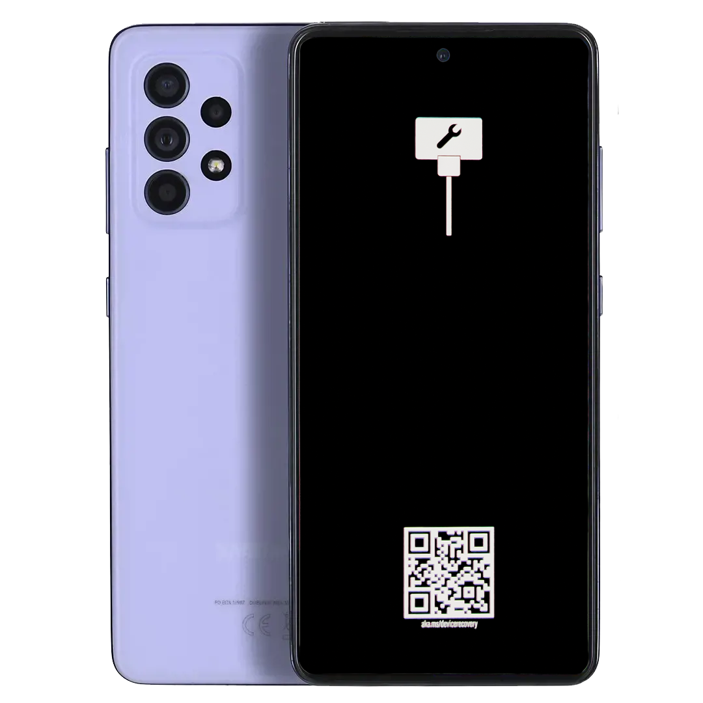
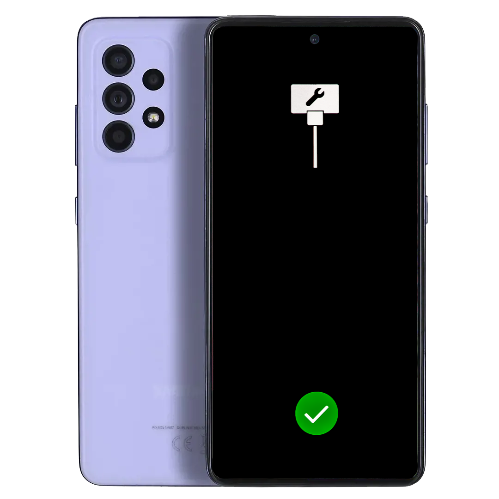

# Install Windows on Galaxy A52s 5G

This guide will help you install Windows manually on your Galaxy A52s 5G.

You will end up with both Android™ and Windows on the device.

Table of Contents:

* [Install Windows on Galaxy A52s 5G](#install-windows-on-galaxy-a52s-5g)
   * [Files/Tools Needed](#filestools-needed)
* [Steps](#steps)
   * [Unlocking the Bootloader](#unlocking-the-bootloader)
   * [Flashing UEFI and TWRP](#flashing-uefi-and-twrp)
   * [Partitioning](#partitioning)
   * [Fixing GPT tables of other LUNs](#fixing-gpt-tables-of-other-luns)
   * [Activating Mass Storage Mode](#activating-mass-storage-mode)
   * [Installing Windows](#installing-windows)
   * [Installing the drivers](#installing-the-drivers)
   * [Boot Windows](#boot-windows)

## Files/Tools Needed

- A Galaxy A52s 5G
- Windows drivers
- UEFI and TWRP images
- imageutility.zip
- FFU for patching LUNs
- SDK platform tools
- A Windows PC to flash the device

## Disclaimers

> [!WARNING]
> - Don't create partitions from Mass Storage Mode on Windows (because ABL will break with blank/spaces in names), your phone may be irrecoverable otherwise
> - If you see a warning and/or error during the process, it is not normal. Contact us on telegram if you see anything odd, but do not continue or proceed on your own, you will break things further.
> - Don't rerun the commands if you interrupt the process. You may break your partition table.
> - Do not run all commands at once.
> - Do not commit *any* typo with *any* commands.
> - Be familiar with command line interfaces.

> [!IMPORTANT]
> **THIS WILL WIPE ALL YOUR ANDROID™ DATA**
>
> We don't take any responsibility for any damage done to your phone. By following this guide, you agree to take full responsibility of your actions. We have done some testing,
>
> but this is **STILL IN PREVIEW** and things can go wrong.

**PLEASE READ AND BE SURE TO UNDERSTAND THE ENTIRE GUIDE BEFORE STARTING**

# Steps

## Acquiring all files


[A52sxq-Drivers-vX.X.X-Desktop.7z](https://github.com/woa-a52s/Samsung-A52s-5G-Releases/releases/latest)

[imageutility.zip](../../Files/imageutility.zip)

[Fix_GPT_LUNs_1-5.ffu](../../Files/Fix_GPT_LUNs_1-5.ffu)

[SDK Platform Tools](https://developer.android.com/tools/releases/platform-tools)

- Download the imageutility.zip archive and extract it on your computer.
- Once you have acquired Fix_GPT_LUNs_1-5.ffu file, place it in the extracted **imageutility** folder.

## Unlocking the Bootloader

If not already done, please first proceed with the [Unlocking the Bootloader](../UnlockingBootloader.md)) guide for Galaxy A52s 5G. Come back once you're done. If you already followed this guide, please skip the unlocking section.

## Flashing UEFI and TWRP

If not already done, please first proceed with the [Flashing TWRP and UEFI](../Flash-UEFI-TWRP.md) guide for Galaxy A52s 5G. Come back once you're done.

## Partitioning

Make sure that either adb is on PATH in your terminal, or you are in the same directory where adb.exe exists.

- While your phone is booted into TWRP recovery and connected to your PC, execute this command to enter recovery shell:

```sh
adb shell
```

- Run a command that sets the LUN0 disk online:

```sh
fix-gpt
```

- Reboot to TWRP again to update partition table changes:

```sh
reboot recovery
```

- Once back in TWRP, in the "Mount" menu untick the checkbox on the userdata partition to unmount it.

- Execute the parted utility:

```sh
parted /dev/block/sda
```

- Enter `p` command to print the existing partitions. Your last partition should be `userdata`.
This partition needs to be deleted and then created again later along with the partitions required for Windows.

- Delete the userdata partition
> Make sure that 34 really is the userdata partition with `p` command first!

```sh
rm 34
```

- Create the ESP partition (571MB):

```sh
mkpart esp fat32 13.2GB 13.8GB
```

- Make the ESP partition bootable:

```sh
set 34 esp on
```

- Create a main partition where Windows will be installed to (in this case, it's 60GB in size):

```sh
mkpart win ntfs 13.8GB 73.8GB
```

- Create Android's userdata partition (in this case, it's 53.6GB in size):

```sh
mkpart userdata ext4 73.8GB 127GB
```

- Quit parted:

```sh
quit
```

- Reboot to TWRP recovery again:

```sh
reboot recovery
```

- Start the adb shell again on your computer:

```sh
adb shell
```

- Format the ESP partition to FAT32 filesystem:

```sh
mkfs.fat -F32 -s1 /dev/block/bootdevice/by-name/esp
```

- Format the Windows partition to NTFS filesystem:

```sh
mkfs.ntfs -f /dev/block/bootdevice/by-name/win
```

- Format userdata partition to F2FS in TWRP menu: Wipe > Format Data > yes

## Fixing GPT tables of other LUNs

Samsung Galaxy A52s 5G UFS storage has incorrectly provisioned GPTs of LUNs that Windows 24H2 and above can easily break, in turn bricking the device.

Flashing a specialized FFU image will correct the GPT tables of LUNs 1-5.

FFU file needs to be flashed in the UFP mode in UEFI. To enter UFP mode, folow these steps:

- Reboot the phone to UEFI
- When UEFI starts to load, hold the volume up button until this shows up on your device:




On your Windows computer, open command prompt or terminal in the **imageutility** directory.

- Enter this command to flash the FFU file on your device:

```
.\imageutility.exe FlashDevice -Path Fix_GPT_LUNs_1-5.ffu
```

The FFU flashing process will start. If the flash is successful, you should see this on your device:



- After a successful flash, reboot the device with this command:

```
.\imageutility.exe RebootDevice
```

Hold the volume up and power buttons to boot to TWRP recovery again.

## Activating Mass Storage Mode

- Once rebooted to TWRP, enter this command in the terminal on your computer:

```batch
adb shell msc
```


## Installing Windows


```batch
⚠️ THESE ARE NOT ALL COMMANDS. DISKPART COMMANDS VARY A LOT, SO THESE ARE SOME ROUGH INSTRUCTIONS.
ACTUAL COMMANDS START WITH AN HASHTAG (which you will need to remove)
YOU DO NOT HAVE TO USE THE LETTERS WE USE AT ALL!!!, THEY ONLY NEED TO BE FREE LETTERS. IF LETTERS DON'T ASSIGN FINE, USE ANOTHER ONE.
IF ONE PARTITION IS ALREADY ASSIGNED, YOU ALSO DO NOT NEED TO ASSIGN IT AGAIN IF YOU DONT WANT TO.

# list disk
Find the Surface Duo Disk, and take note of the number.
# select disk <number>
# list partition
You will be able to recognize the partitions we made earlier by their size. take note of the ESP and WIN partition numbers.
# select partition <esp-partition-number>
# assign letter=<THE LETTER YOU WANT AS LONG AS IT IS NOT CURRENTLY IN USE IN FILE EXPLORER FOR ANOTHER DRIVE! (Example: X)>:
# select partition <win-partition-number>
# assign letter=<ANOTHER LETTER YOU WANT AS LONG AS IT IS NOT CURRENTLY IN USE IN FILE EXPLORER FOR ANOTHER DRIVE! (Example: Y)>:
```

- With an administrator shell on your computer, execute diskpart:

```batch
diskpart
```

- List all the available disks on your computer:

```batch
list disk
```

- Choose the mass storage disk of Galaxy A52s (in this example it's Nr. 2):

```batch
select disk 2
```

- List all partitions of the selected disk:

```batch
list partition
```

- Select the ESP partition number (in this example it's Nr. 34):

```batch
select partition 34
```

- Assign any available drive letter to the ESP partition (in this example it's S):

```batch
assign letter S
```

- Select the Windows partition number (in this example it's Nr. 35):

```batch
select partition 35
```

- Assign any available drive letter to the Windows partition (in this example it's X):

```batch
assign letter X
```

- Exit diskpart:

```batch
exit
```

After this operation there will be 2 drives with the drive letters that were assigned with the commands. Take note of the letters you've used.

> [!WARNING]
From now on we will assume X: is the Win partition and that S: is the ESP partition for all the commands. You very very likely used other letters, or have to use other letters. Replace them correctly with what you previously picked or you will lose data on your PC.

- We will need our install.wim file now. If you haven't retrieved a Windows ISO yet, you can [use this guide](../ISO/GetWindows.md). When you are ready, run these commands:

```batch
dism /apply-image /ImageFile:"<path to install.wim>" /index:1 /ApplyDir:X:\
```

This will take a bit of time. Go make some coffee ☕ or some tea 🍵.

- Once that is done, generate the BCD boot files:

```batch
bcdboot X:\Windows /s S: /f UEFI
```

- Allow unsigned drivers and disable failure checks:

```batch
bcdedit /store S:\EFI\Microsoft\BOOT\BCD /set "{default}" testsigning on
bcdedit /store S:\EFI\Microsoft\BOOT\BCD /set "{default}" nointegritychecks on
bcdedit /store S:\EFI\Microsoft\BOOT\BCD /set "{default}" recoveryenabled no
bcdedit /store S:\EFI\Microsoft\BOOT\BCD /set "{default}" bootstatuspolicy IgnoreAllFailures
```

Windows is now installed but has no drivers.

## Installing the drivers

- Download the latest driver package from https://github.com/woa-a52s/Galaxy-A52s-5G-Releases/releases/latest

- Extract the driver package, and go to the folder where you extracted it.

- Double click the ```OfflineUpdater.cmd``` file.

- Accept the User Account Control warning when prompted

- Enter the drive letter of the connected phone in mass storage, as we previously mentioned, for us it's currently ```X:```, but it may very well be different for you. In our example, we enter ```X:``` and then press enter.

- The process may take a while, once it is done, you will be prompted to press any key, press enter when that's the case.

Congratulations, you just installed your drivers!

- You can now reboot your phone and boot to Windows.

## Boot Windows

If you did everything right, Windows will now boot! Enjoy!

Let Windows set itself up, it is normal for Windows to reboot in the installation process.
