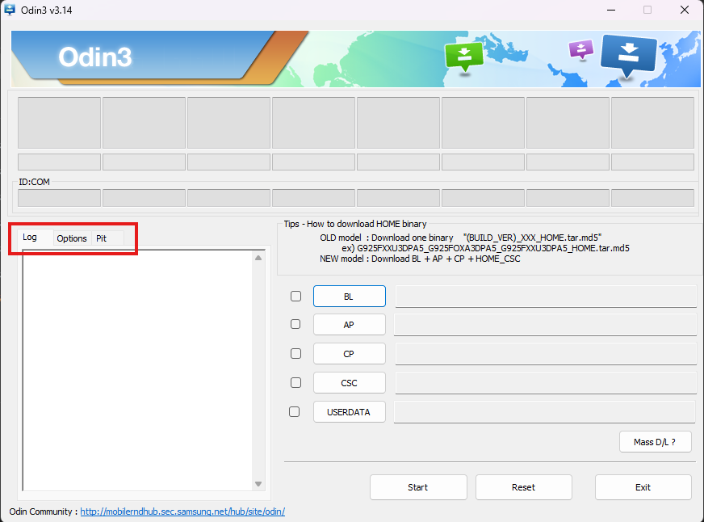
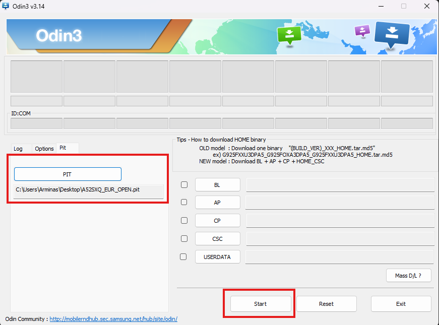

# Uninstall Windows and revert your Galaxy A52s 5G to stock

This guide will help you go back to a normal Galaxy A52s 5G, with Android™ only.

Just like you had it before installing Windows.

Android™ will have access to the whole memory back again. All LUNs (0-5) will be restored to stock.

Your data will be erased, please make backups if you need it before proceeding!

This guide works if you haven't broke anything else in the meantime.

If you broke anything, this guide wont help you and will likely make things worse.

Contact us instead for help!

## Files/Tools Needed

- [Samsung USB drivers](https://developer.samsung.com/android-usb-driver)
- [Odin flashing utility](../Files/Odin3_v3.14.4.zip)
- [PIT file](../Files/A52SXQ_EUR_OPEN.pit)

## Disclaimers

> [!IMPORTANT]
> **THIS WILL WIPE ALL YOUR ANDROID™ DATA**
>
> We don't take any responsibility for any damage done to your phone. By following this guide, you agree to take full responsibility of your actions. We have done some testing,
>
> but this is **STILL IN PREVIEW** and things can go wrong.

# Steps

## Acquiring all files

Download and install the Samsung USB drivers to use Odin.

Extract the downloaded Odin3_v3.14.4.zip archive and open the Odin executable.

## Booting to Download Mode

To flash the PIT file you will need to boot your phone into Download mode.

You can choose to do this with either of these options:

**Boot to Download mode with button combinations**
- While the phone is powered off, hold both Volume up and Volume down buttons together
and connect your phone to the PC with a USB cable.
- Your phone will now boot to Download mode, then again press
Volume up button to continue and your phone should get detected on Windows.

**Boot to Download mode from recovery**
- If you're using a custom recovery like TWRP or OrangeFox, you can reboot to Download mode
in the recovery's `Reboot` menu by selecting `Download`.

## Re-partitioning the UFS

Open Odin application that you have downloaded from the prerequisites section before.

Select the Pit tab in Odin. You will get a warning that this functionality is used for engineers only. You can safely ignore this message.

Click on the PIT button and load the PIT file that you have downloaded from the prerequisites before.
After you inserted the file, simply click the `Start` button.

You should see a message in Odin that the flash was successful and your phone should reboot.

If you've done everything correctly, your phone should be restored to the stock partition layout.
